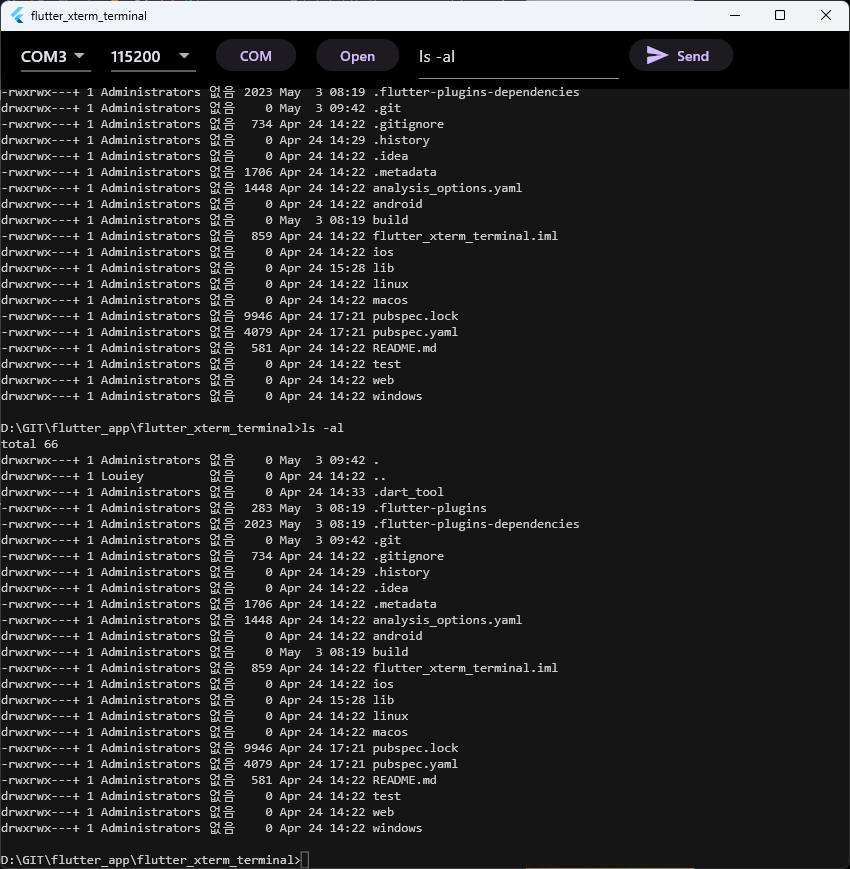

# flutter_xterm_terminal

Serial terminal sample application

- Wanted to write terminal app based on Flutter
- Found xterm package and it's perfect one I find
  - <https://github.com/TerminalStudio/xterm.dart>
  - Package looks quite good
  - Code referred from <https://github.com/TerminalStudio/xterm.dart/tree/master/example/lib>
  

## Getting Started

- Press "COM" and select COM port
- Press "Open"
- It should open port but it returns error, 5
  - if manually input from terminal, not send from open button, it works well
    - type "plink -serial COM3 -sercfg 115200,8,1,N,N" by manually, and it works
  - still debugging to find out root cause of the issue
  
## TODO

- Fix "ERROR_ACCESS_DENIED" issue when open COM port via Open button
- Add log file option
- Add more buttons accordingly
